Demo Application for Roof Stacks Company 
--------------------------------------
This  application is prepared for the "**Roof Stacks Company**" job task.  This application is a simple wallet services application which is able to integrate with our payment system.

How to run the project:
-----------------------

On a separate terminal and since this is a maven project you just need to go to the root of the project and perform the command:
```
mvn clean install
```
or if you don't have installed maven on your OS

```
mvnw clean install
```


This will run the unit tests of the project and create the jar file.

After having the jar file you can simply run:

```
java -jar target/wallet-service-0.0.1-SNAPSHOT.jar
```

Since this is a Spring Boot project, you can also run the project with below command;
```
mvn spring-boot:run
```

or if you don't have installed maven on your OS
```
mvnw spring-boot:run
```

The project will run on port 8080 (configured as default).


How to test the project:
-----------------------

* _JWT Authentication_ is enabled for the project. For this reason, it is necessary to get a valid token at first.
* If there is a registered user on the system, this user can be used to get a JWT token. If there is no user, it is necessary to sign up a user;


**Request URL;**

`http://localhost:8080/api/sign-up`


**Request Body;**

`{
"password": "koray",
"username": "pass"
}`


**or cURL;**

`curl -X POST "http://localhost:8080/api/sign-up" -H "accept: */*" -H "Content-Type: application/json" -d "{ "password": "koray", "username": "pass"}"`

* After sign-up, it is necessary to login for get a valid JWT token. To do this; send a POST request with signed up user to; http://localhost:8080/login
* Token will be inside of headers (with "Authorization" key)

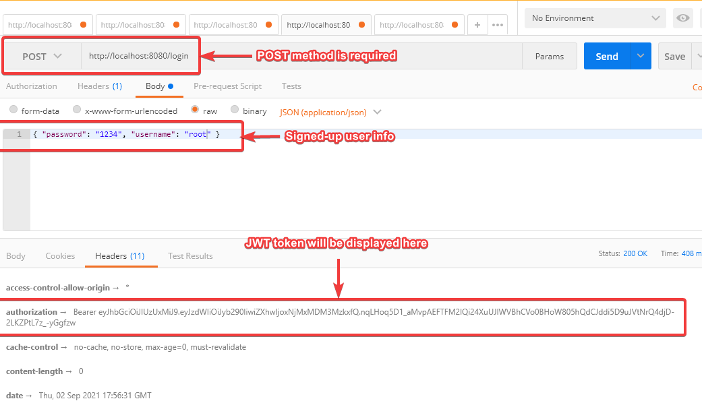


* After getting a valid token, you can test the project from Swagger API UI. To access Swagger UI, go to;  
* http://localhost:8080/swagger-ui.html

Example screenshot;

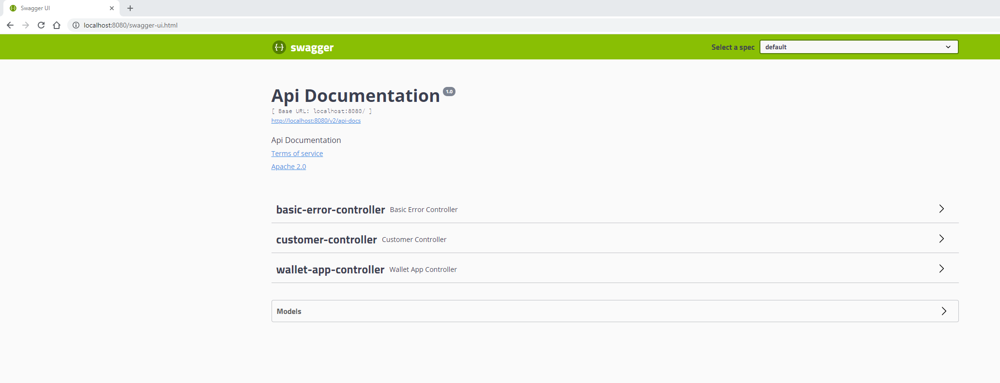

* Taken JWT token must be written to Authorization section of Swagger;

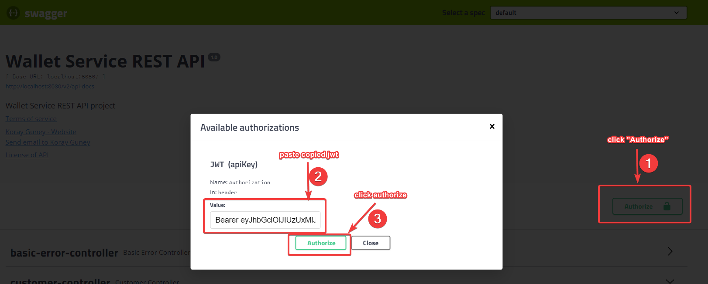

According to Roof Stacks task functional requirements;

### Testing Business Rule-1 : 
#### 'Users can add new wallets to this service. The wallet supports different currencies';

1. At first step, **_customer_** must be saved. Select **/api/customer/save-customer** under **customer-controller** and then **Try it out**
  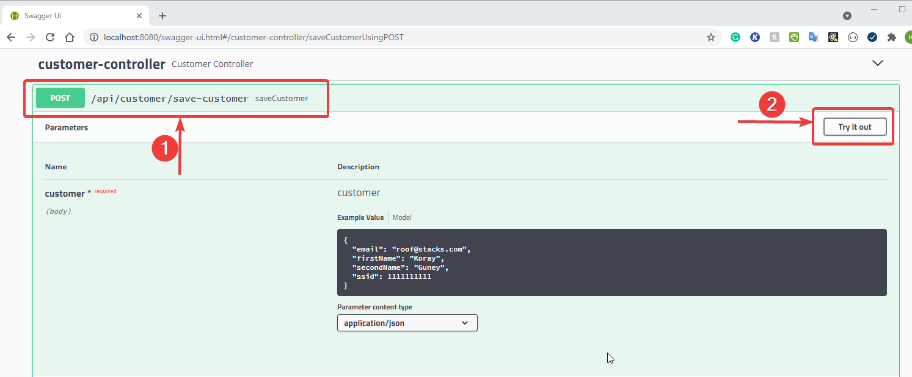

2. Prepare request body into JSON format and press **Execute**;
  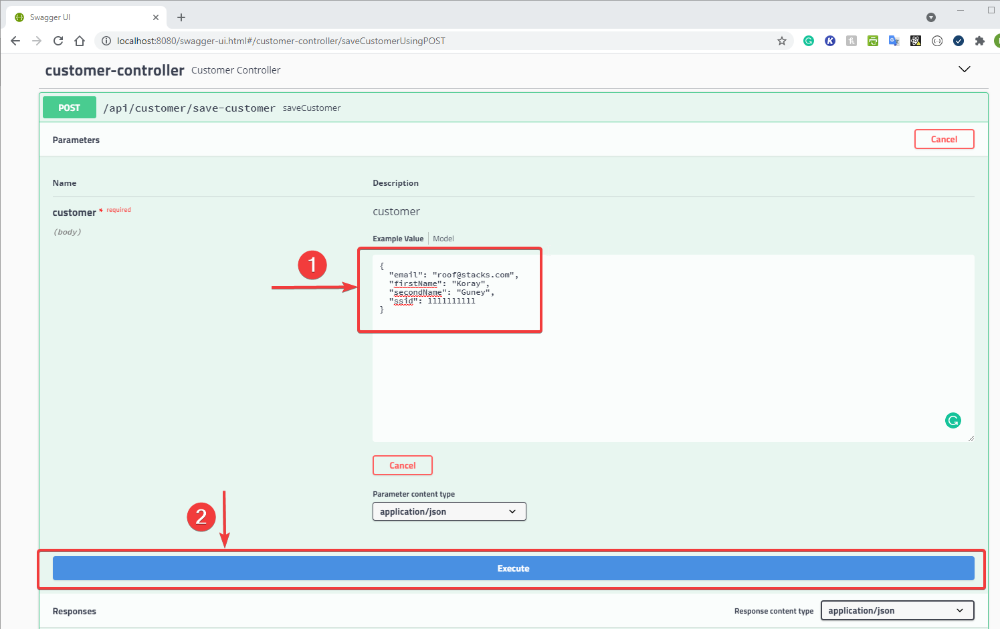

3. For example; to request a save a customer, prepare a request body like;
```
{
  "email": "roof@stacks.com",
  "firstName": "Koray",
  "secondName": "Guney",
  "ssid": 1111111111
}
```
4. For valid requests, successful server response (200 Status code) will return; (_'id' value is important to save wallet later on_)
   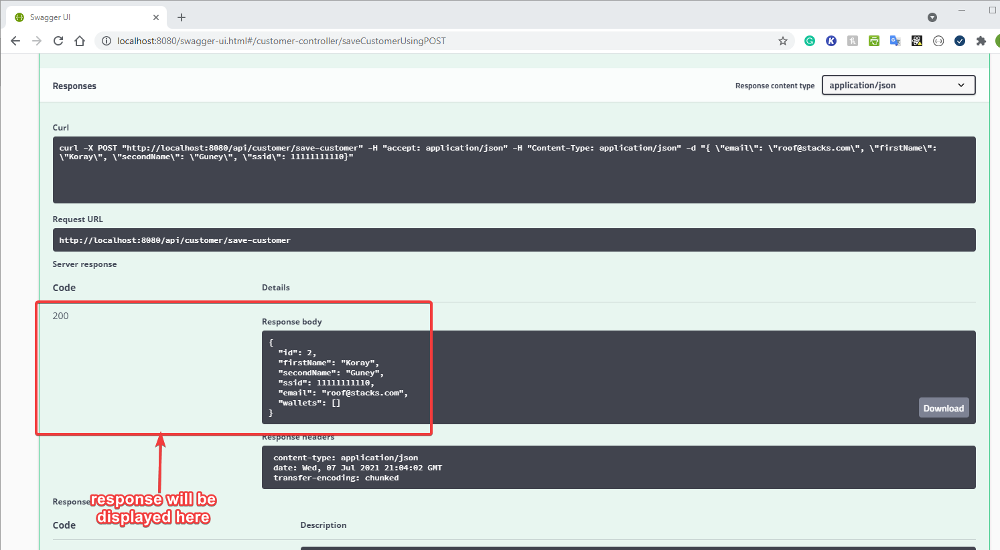

5. There are some validations and business requirements to generate a valid request to save a customer;
* Email must be in valid email format. e.g. **_roof@stacks.com_**
* SSID must include only numbers
* SSID is unique. Any other customer cannot be saved with same SSID. Instead, the server response (error) will be like below;
  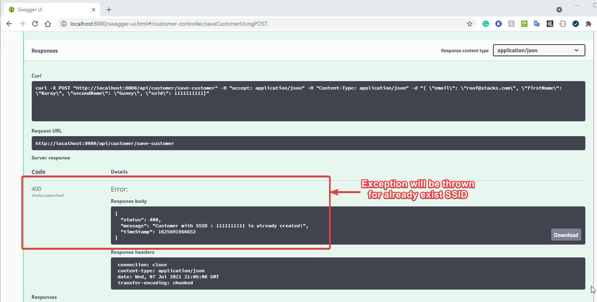

6. Now, it is possible to save a wallet.  Select **/api/wallet/save-wallet** under **wallet-app-controller** and then **Try it out**
   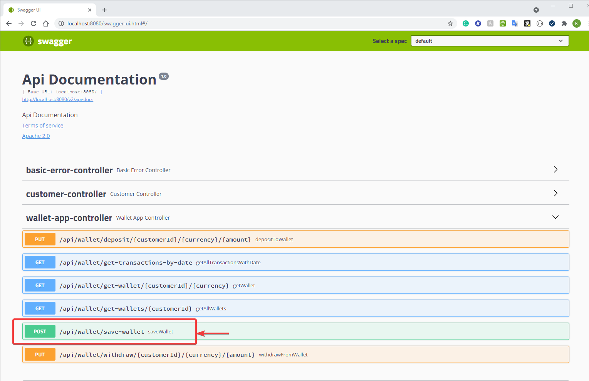

7. Prepare request body into JSON format and press **Execute**;
   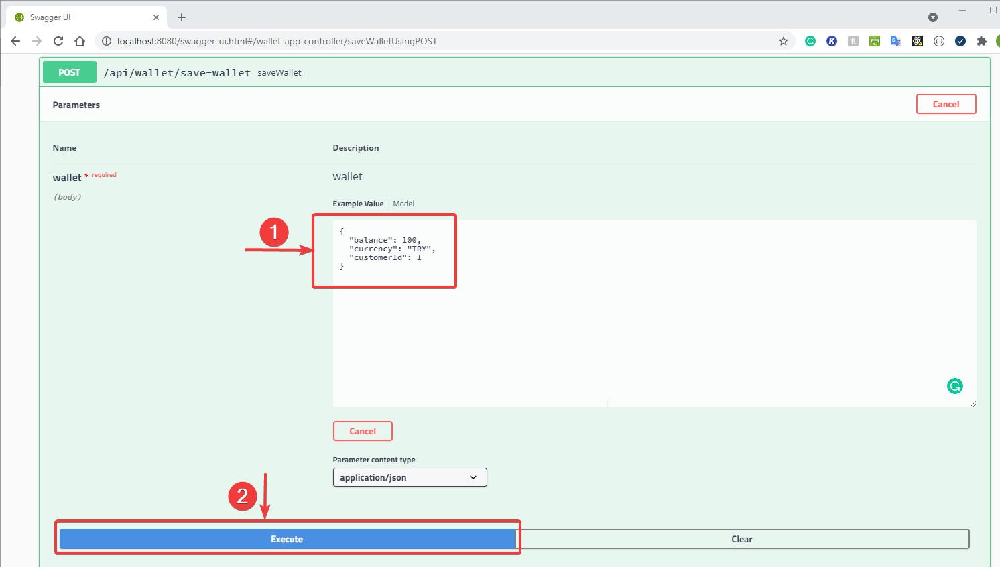
   
8. For example; to request a save a wallet, prepare a request body like;
```
{
  "balance": 100,
  "currency": "TRY",
  "customerId": 1
}
```
9. Multiple wallets can be declared with different currency types for a customer. 
    
10. There are some validations and business requirements to generate a valid request to save a wallet;
* Currency value must only include one of these values; (lowercase is also accepted)
    * TRY
    * USD
    * EUR
    * GBP
* _customerId_ must belongs to a valid customer on database. Instead, the server response (error) will be like below;
  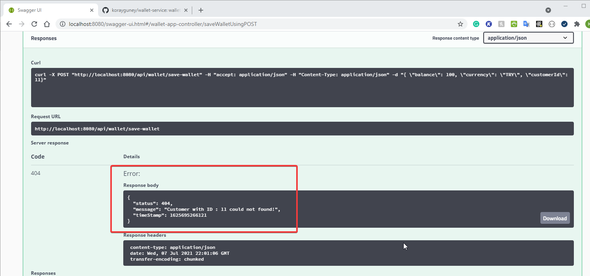

* A customer must have only one wallet with same currency type. Instead, the server response (error) will be like below;
  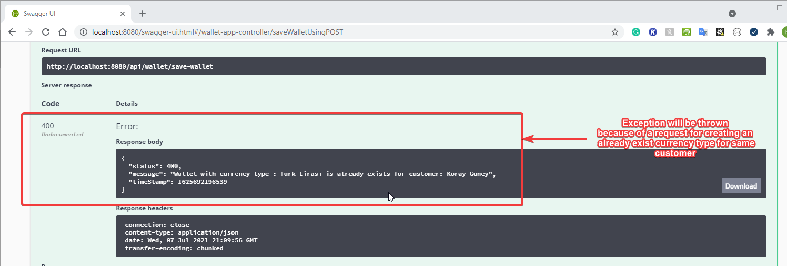

### Testing Business Rule-2 :
#### 'Users can deposit/withdraw the requested amount to the wallet that you have created';

1. **To deposit an amount**, Select **/api/wallet/deposit** under **wallet-app-controller** and then **Try it out**
   
2. Write valid inputs and press **Execute**, then server response will be displayed with new balance amount;
   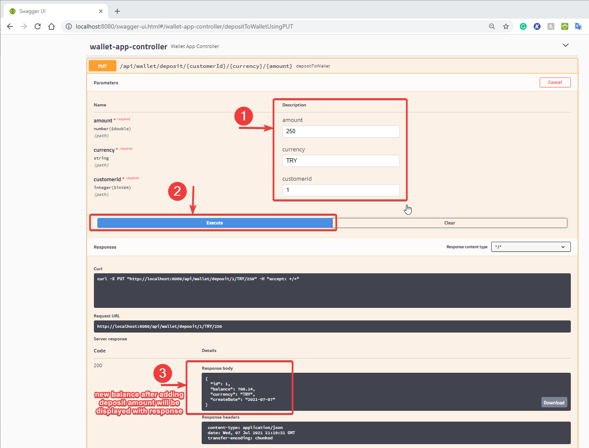

3. There are some validations and business requirements to generate a valid request to deposit an amount into wallet;
* Currency value must only include one of these values; (lowercase is also accepted)
    * TRY
    * USD
    * EUR
    * GBP
* Customer must be exists with declared customerId on database.
* Customer must already have a wallet with declared currency.  

4. **To withdraw an amount**, Select **/api/wallet/withdraw** under **wallet-app-controller** and then **Try it out**

5. Write valid inputs and press **Execute**

6. There are some validations and business requirements to generate a valid request to withdraw an amount from wallet;
* Currency value must only include one of these values; (lowercase is also accepted)
    * TRY
    * USD
    * EUR
    * GBP
* Customer must be exists with declared customerId on database.
* Customer must already have a wallet with declared currency.
* Customer balance amount must be enough for requested withdraw amount. Instead, the server response (error) will be like below;
  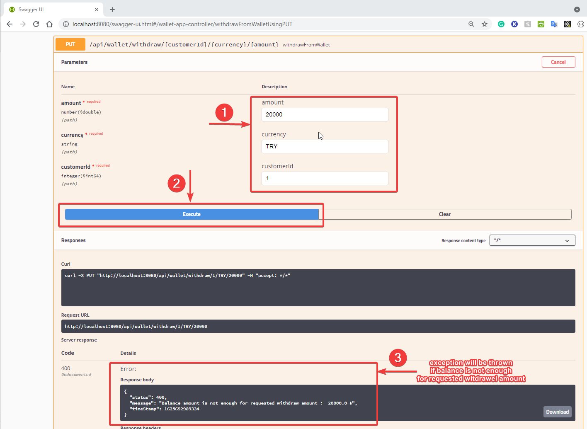

### Testing Business Rule-3 :
#### 'Users can query the current balance';

1. To query the current balance, Select **/api/wallet/get-wallets/{customerId}** under **wallet-app-controller** and then **Try it out**

2. Write valid inputs and press **Execute**, then server response will be displayed with all wallet details that includes balance;
   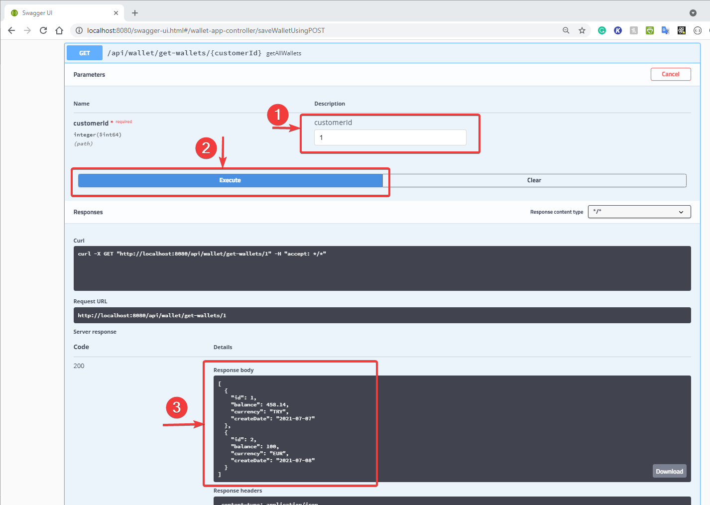
   
3. To query with specific currency type, Select **/api/wallet/get-wallets/{customerId}/{currency}** 
   under **wallet-app-controller** and then **Try it out**
   
4. Write valid inputs and press **Execute**, then server response will be displayed with the wallet details that includes balance.

### Testing Business Rule-4 :
#### 'All transactions could be able to report.';

1. To query all transactions, Select **/api/wallet/get-transactions-by-date** under **wallet-app-controller** and then **Try it out**

2. Write valid inputs and press **Execute**; (Date must be in declared format. e.g. **_08/07/2021_**)
   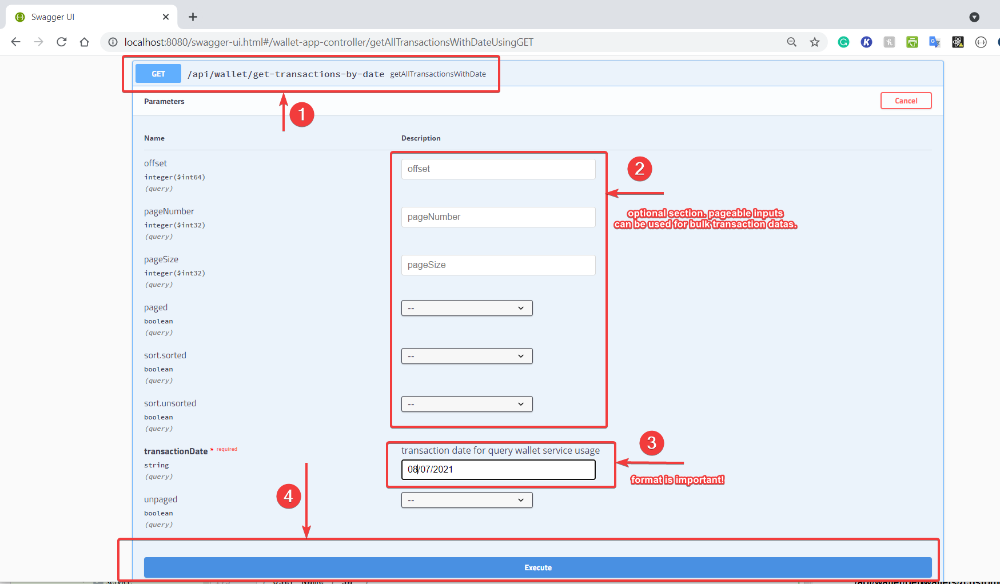
   
3. Then server response will be displayed;
   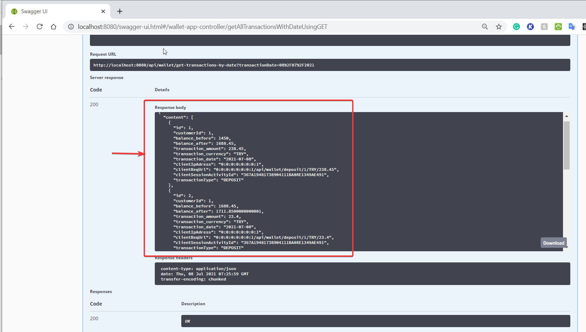

4. The query data has pageable function. For bulk data results, pageable parameters could be set optionally.

5. It is also possible to display transaction details on database with queries. Follow **['Database login'](#Database-login-)** section to access database.
   


### Database login

This project is using H2 database to store required data. To access H2 console;
*  http://localhost:8080/h2-console/

After that, login screen will be displayed;

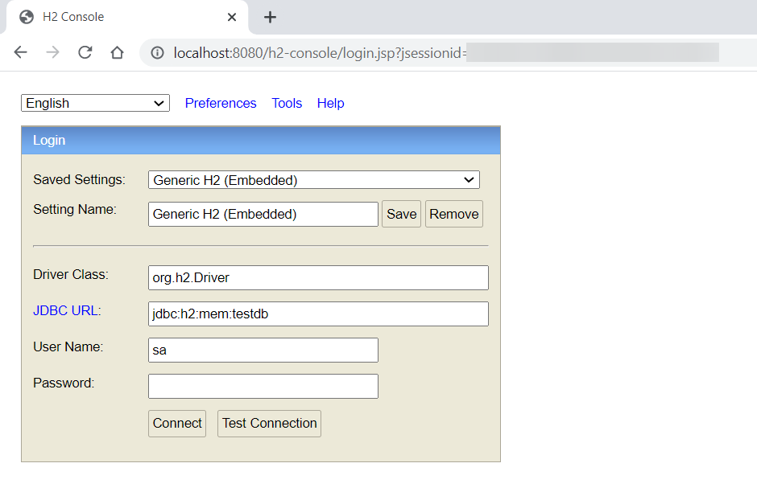

To login, below credentials must be written to login screen and then click **Connect**;

| Part  | Input |
| ------------- | ------------- |
| Driver Class  | org.h2.Driver |
| JDBC URL  | jdbc:h2:mem:testdb  |
| User Name | sa  |
| Password  | password  |

### ELK Stack Support

To use ELK Stack APIs (Elasticsearch, Logstash and Kibana), follow the instructions at below;

#### Logstash
1. Download and unzip Logstash from; 
    * https://www.elastic.co/downloads/logstash

2. Generate a logging file that will be aggregated from Logstash. Declare a property into application.yml such as;
```
logging:
  file:
    name: wallet-service.log
```

3. Prepare a config file named **'logstash.conf'** under downloaded logstash directory . e.g; _(Change paths according to your project paths)_
```
input { 
	file {
		type=>"wallet-service-log"
		path=>"C:\Users\koray\Git Projects\wallet-service\wallet-service.log"
	}
}

output {
	if [type] == "wallet-service-log" {
		elasticsearch { 
			hosts => ["localhost:9200"]
			index => "wallet-service-%{+YYYY.MM.dd}"
		}
	}
  stdout { codec => rubydebug }
}
```

4. Connect to the terminal and execute command under downloaded logstash directory to start logstash;
```
bin/logstash -f logstash.conf (for MAC-OS or UNIX)
bin\logstash.bat -f logstash.conf (for WINDOWS)
```

#### Elasticsearch
1. Download and unzip Elasticsearch from;
    * https://www.elastic.co/downloads/elasticsearch
2. Run **bin/elasticsearch** (or **bin\elasticsearch.bat** on Windows)
3. Run _**curl http://localhost:9200/**_ or **_Invoke-RestMethod http://localhost:9200_** with PowerShell. You should 
display below JSON response;
```
{
    "name": "LAPTOP-xxxxxx",
    "cluster_name": "elasticsearch",
    "cluster_uuid": "xxxxxxxxxxxx",
    "version": {
        "number": "7.13.4",
        "build_flavor": "default",
        "build_type": "zip",
        "build_hash": "xxxxxxxxxxxxxxxxxxxxxxxxxxxx",
        "build_date": "2021-07-14T18:33:36.673943207Z",
        "build_snapshot": false,
        "lucene_version": "8.8.2",
        "minimum_wire_compatibility_version": "6.8.0",
        "minimum_index_compatibility_version": "6.0.0-beta1"
        },
    "tagline": "You Know, for Search"
}
```
4. After running the Spring Boot application, browse to the; **http://localhost:9200/_cat/** to display 
available endpoints. Result would be;
```
=^.^=
/_cat/allocation
/_cat/shards
/_cat/shards/{index}
/_cat/master
/_cat/nodes
/_cat/tasks
/_cat/indices
/_cat/indices/{index}
/_cat/segments
/_cat/segments/{index}
/_cat/count
/_cat/count/{index}
/_cat/recovery
/_cat/recovery/{index}
/_cat/health
/_cat/pending_tasks
/_cat/aliases
/_cat/aliases/{alias}
/_cat/thread_pool
/_cat/thread_pool/{thread_pools}
/_cat/plugins
/_cat/fielddata
/_cat/fielddata/{fields}
/_cat/nodeattrs
/_cat/repositories
/_cat/snapshots/{repository}
/_cat/templates
/_cat/ml/anomaly_detectors
/_cat/ml/anomaly_detectors/{job_id}
/_cat/ml/trained_models
/_cat/ml/trained_models/{model_id}
/_cat/ml/datafeeds
/_cat/ml/datafeeds/{datafeed_id}
/_cat/ml/data_frame/analytics
/_cat/ml/data_frame/analytics/{id}
/_cat/transforms
/_cat/transforms/{transform_id}
```   
5. Browse to the **http://localhost:9200/_cat/indices** to display indexed log files. Then browse to 
the indexed logs such as; **http://localhost:9200/wallet-service-2021.07.21/_search?q=*&format&pretty**
(change suffix date according to the displayed indices)
   
#### Kibana
1. Download and unzip Kibana from;
    * https://www.elastic.co/downloads/kibana
2. Run **bin/kibana** (or **bin\kibana.bat** on Windows)
3. Point your browser at **http://localhost:5601** and select Index Patterns from the left panel;

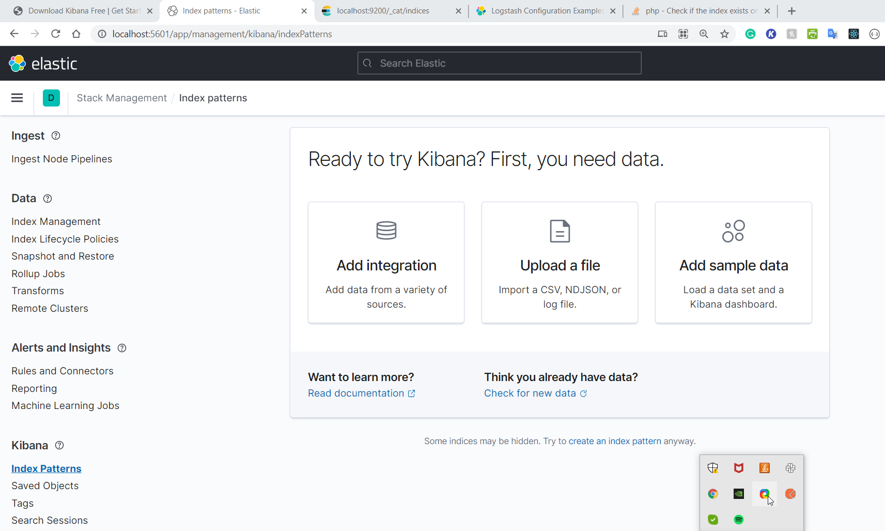
   
### Dockerize ELK Stack
In this project, docker can be used to manage application and trace logs via ELK stack APIs.
#### Building the applications and creating Docker images
Wallet service use the `dockerfile-maven` plugin from Spotify to make the Docker build process integrate with the Maven build process. So when we build a Spring Boot artifact, we'll also build a Docker image for it.

To build the Spring Boot applications and their Docker images:

- Go to the `wallet-service` folder: `cd wallet-service` from terminal
- Build the application and create a Docker image: `mvn clean install`

#### Spinning up the containers

In the root folder of our project, where the `docker-compose.yml` resides, spin up the Docker containers running `docker-compose up`.

#### Visualizing logs in Kibana

- Open Kibana in your favourite browser: `http://localhost:5601`. When attempting to to access Kibana while it's starting, a message saying that Kibana is not ready yet will be displayed in the browser. Enhance your calm, give it a minute or two and then you are good to go.

- In the first time you access Kibana, a welcome page will be displayed. Kibana comes with sample data in case we want to play with it. 
  - To explore the data generate by our applications, click the _Explore on my own_ link.
  - On the left hand side, click the _Discover_ icon.
  - Kibana uses index patterns for retrieving data from Elasticsearch. As it's the first time we are using Kibana, we must create an index pattern to explore our data. We should see an index that has been created by Logstash. So create a pattern for matching the Logstash indexes using `logstash-*` and then click the _Next step_ button.

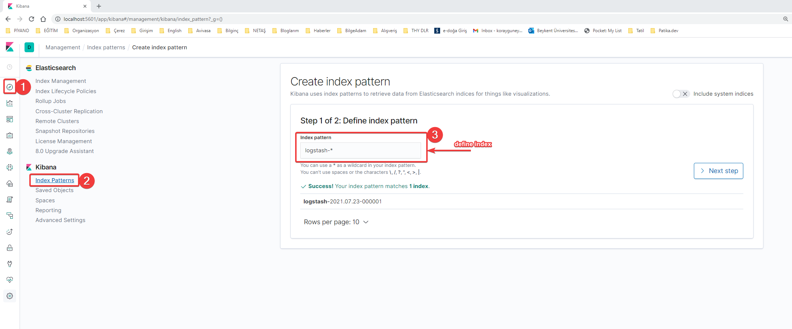

  - Then pick a field for filtering the data by time. Choose `@timestamp` and click the _Create index pattern_ button.

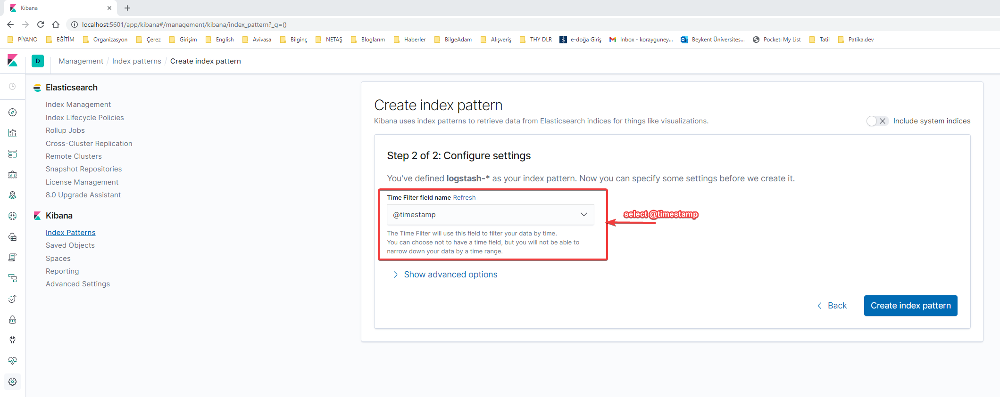

- The index pattern will be created. Click again in the _Discover_ icon and the log events of both post and comment services start up will be shown:

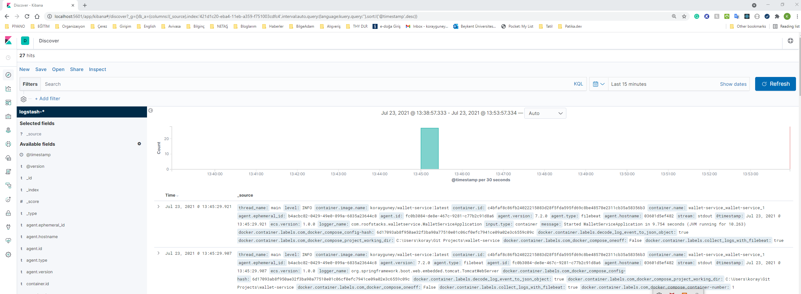
