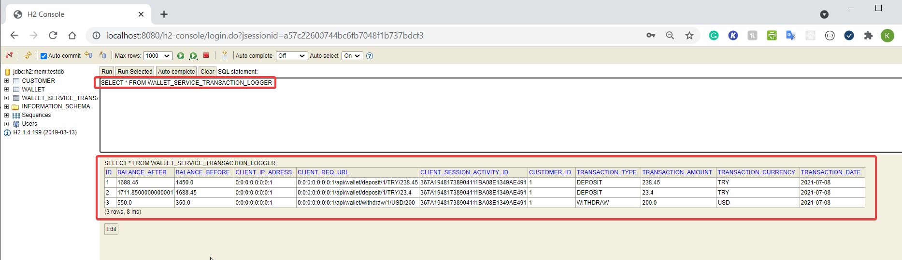

Demo Application for Roof Stacks Company 
--------------------------------------
This  application is prepared for the "**Roof Stacks Company**" job task.  This application is a simple wallet services application which is able to integrate with our payment system.

How to run the project:
-----------------------

On a separate terminal and since this is a maven project you just need to go to the root of the project and perform the command:
```
mvn clean install
```
or if you don't have installed maven on your OS

```
mvnw clean install
```


This will run the unit tests of the project and create the jar file.

After having the jar file you can simply run:

```
java -jar target/wallet-service-0.0.1-SNAPSHOT.jar
```

Since this is a Spring Boot project, you can also run the project with below command;
```
mvn spring-boot:run
```

or if you don't have installed maven on your OS
```
mvnw spring-boot:run
```

The project will run on port 8080 (configured as default).


How to test the project:
-----------------------

You can test the project from Swagger API UI. To access Swagger UI, go to;  
* http://localhost:8080/swagger-ui.html

Example screenshot;


According to Roof Stacks task functional requirements;

### Testing Business Rule-1 : 
#### 'Users can add new wallets to this service. The wallet supports different currencies';

1. At first step, **_customer_** must be saved. Select **/api/customer/save-customer** under **customer-controller** and then **Try it out**
  

2. Prepare request body into JSON format and press **Execute**;
  

3. For example; to request a save a customer, prepare a request body like;
```
{
  "email": "roof@stacks.com",
  "firstName": "Koray",
  "secondName": "Guney",
  "ssid": 1111111111
}
```
4. For valid requests, successful server response (200 Status code) will return; (_'id' value is important to save wallet later on_)
   

5. There are some validations and business requirements to generate a valid request to save a customer;
* Email must be in valid email format. e.g. **_roof@stacks.com_**
* SSID must include only numbers
* SSID is unique. Any other customer cannot be saved with same SSID. Instead, the server response (error) will be like below;
  

6. Now, it is possible to save a wallet.  Select **/api/wallet/save-wallet** under **wallet-app-controller** and then **Try it out**
   

7. Prepare request body into JSON format and press **Execute**;
   
   
8. For example; to request a save a wallet, prepare a request body like;
```
{
  "balance": 100,
  "currency": "TRY",
  "customerId": 1
}
```
9. Multiple wallets can be declared with different currency types for a customer. 
    
10. There are some validations and business requirements to generate a valid request to save a wallet;
* Currency value must only include one of these values; (lowercase is also accepted)
    * TRY
    * USD
    * EUR
    * GBP
* _customerId_ must belongs to a valid customer on database. Instead, the server response (error) will be like below;
  

* A customer must have only one wallet with same currency type. Instead, the server response (error) will be like below;
  

### Testing Business Rule-2 :
#### 'Users can deposit/withdraw the requested amount to the wallet that you have created';

1. **To deposit an amount**, Select **/api/wallet/deposit** under **wallet-app-controller** and then **Try it out**
   
2. Write valid inputs and press **Execute**, then server response will be displayed with new balance amount;
   

3. There are some validations and business requirements to generate a valid request to deposit an amount into wallet;
* Currency value must only include one of these values; (lowercase is also accepted)
    * TRY
    * USD
    * EUR
    * GBP
* Customer must be exists with declared customerId on database.
* Customer must already have a wallet with declared currency.  

4. **To withdraw an amount**, Select **/api/wallet/withdraw** under **wallet-app-controller** and then **Try it out**

5. Write valid inputs and press **Execute**

6. There are some validations and business requirements to generate a valid request to withdraw an amount from wallet;
* Currency value must only include one of these values; (lowercase is also accepted)
    * TRY
    * USD
    * EUR
    * GBP
* Customer must be exists with declared customerId on database.
* Customer must already have a wallet with declared currency.
* Customer balance amount must be enough for requested withdraw amount. Instead, the server response (error) will be like below;
  

### Testing Business Rule-3 :
#### 'Users can query the current balance';

1. To query the current balance, Select **/api/wallet/get-wallets/{customerId}** under **wallet-app-controller** and then **Try it out**

2. Write valid inputs and press **Execute**, then server response will be displayed with all wallet details that includes balance;
   
   
3. To query with specific currency type, Select **/api/wallet/get-wallets/{customerId}/{currency}** 
   under **wallet-app-controller** and then **Try it out**
   
4. Write valid inputs and press **Execute**, then server response will be displayed with the wallet details that includes balance.

### Testing Business Rule-4 :
#### 'All transactions could be able to report.';

1. To query all transactions, Select **/api/wallet/get-transactions-by-date** under **wallet-app-controller** and then **Try it out**

2. Write valid inputs and press **Execute**; (Date must be in declared format. e.g. **_08/07/2021_**)
   
   
3. Then server response will be displayed;
   

4. The query data has pageable function. For bulk data results, pageable parameters could be set optionally.

5. It is also possible to display transaction details on database with queries. Follow **['Database login'](#Database-login-)** section to access database.
   


### Database login

This project is using H2 database to store locally the url/deeplink conversion requests/responses. To access H2 console;
*  http://localhost:8080/h2-console/

After that, login screen will be displayed;


To login, below credentials must be written to login screen and then click **Connect**;

| Part  | Input |
| ------------- | ------------- |
| Driver Class  | org.h2.Driver |
| JDBC URL  | jdbc:h2:mem:testdb  |
| User Name | sa  |
| Password  | password  |

